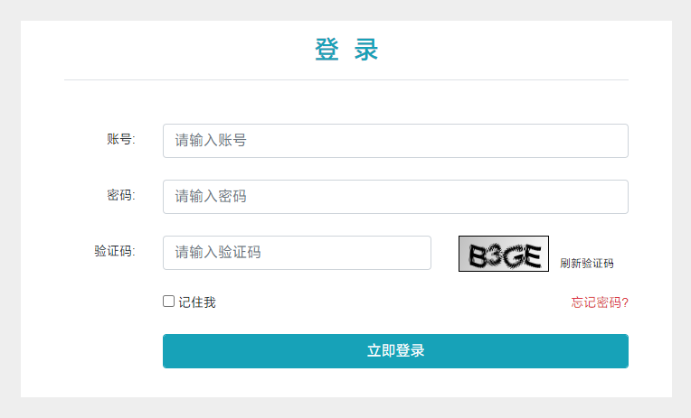
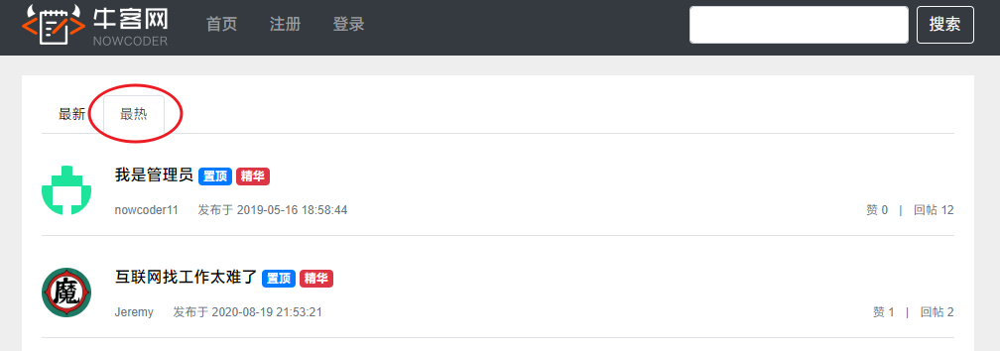
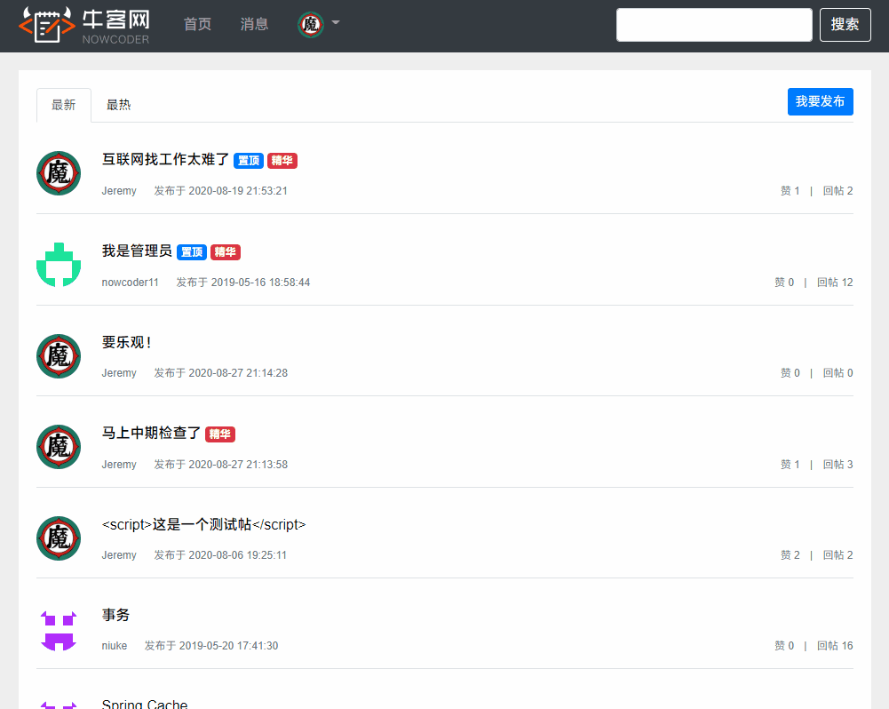
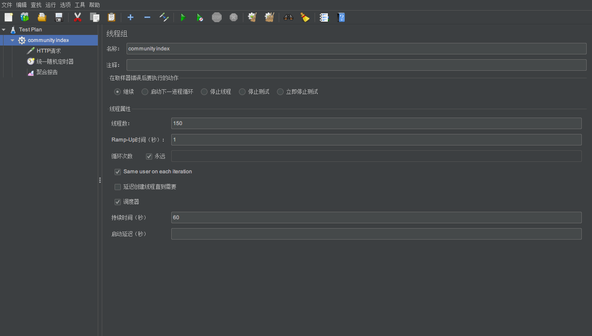
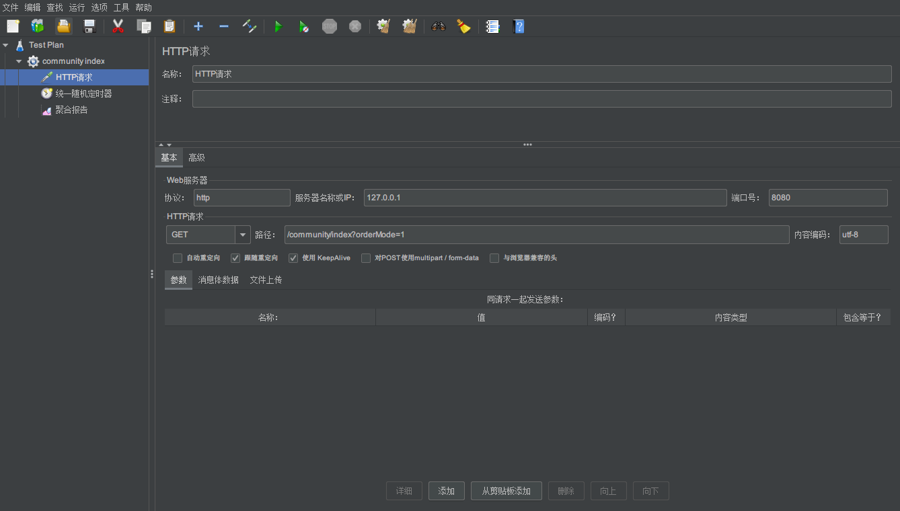
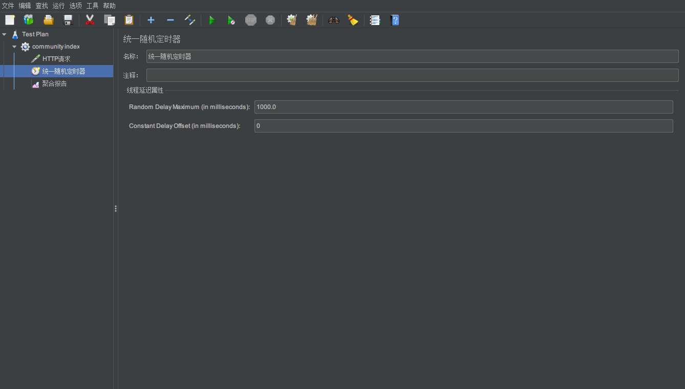
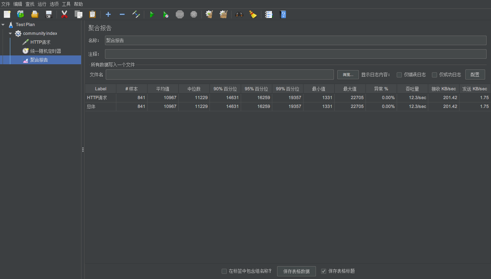
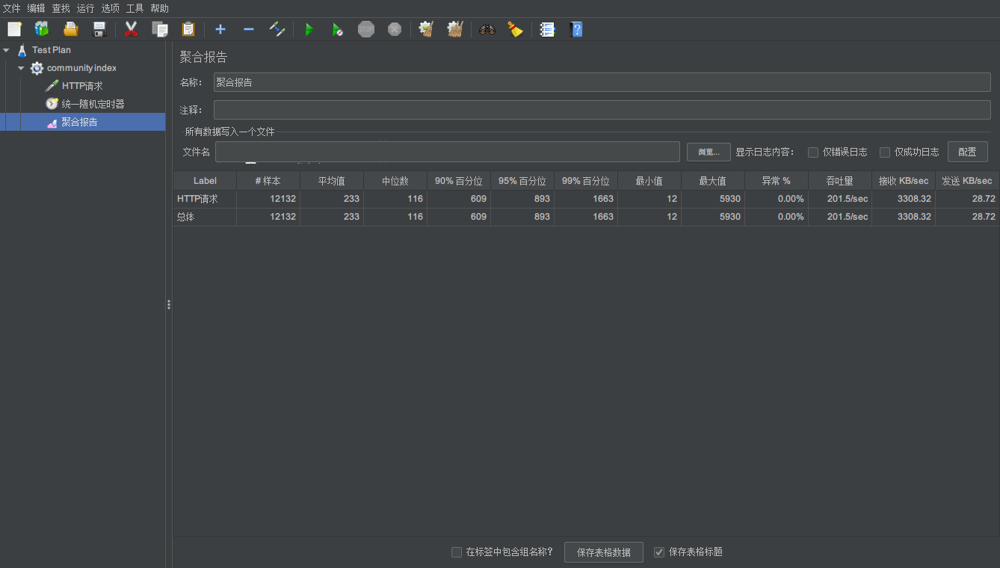

声明：该项目学习自牛客网项目实战。


<div align="center">
    <h1>
        简易版牛客网讨论区
    </h1>
</div>

<!-- GFM-TOC -->

* [技术架构](#技术架构)

* [开发环境](#开发环境)

* [运行环境](#运行环境)

* [登录模块](#登录模块)
  * [分析](#分析)
  * [实现](#实现)

* [热门帖子](#热门帖子)
    * [分析](#分析)
      
    * [实现](#实现)

* [交互设计](#交互设计)
    - [异步发帖](#异步发帖)

* [性能测试](#性能测试)

<!-- GFM-TOC -->

## 技术架构

- Spring Boot
- Spring、Spring MVC、MyBatis
- Redis、Caffeine
- Spring Security

## 开发环境

- 构建工具：Maven
- 集成开发工具：IntelliJ IDEA
- 数据库：MySQL、Redis
- 应用服务器：Tomcat
- 版本控制工具：Git

## 运行环境

单机项目。

- CPU : Intel(R) Core(TM) i5-4200U 双核四线程
- 内存 : Size: 16 GB Type: RAM

## 登录模块

<div align="center">
    
</div>

### 分析

登录模块需要进行验证码校验、查询用户的登录凭证以及校验用户信息。验证码需要被频繁地访问与刷新，因此对性能要求较高，同时，验证码不需要永久保存，短时间内就会失效；而用户每次登录时，服务器都需要先查询用户的登录凭证，然后访问数据库，因此访问登录凭证的频率很高。考虑将验证码和用户登录凭证存入 Redis 中，同时将用户信息也存入 Redis，每次查询用户时，先从 Redis 中查询，如果没有，再去访问 MySQL，同时将数据存入 Redis，提高查询性能。

### 实现

```java
/**
 * 生成验证码并将验证码图片输出给浏览器
 *
 * @param response
 */
@RequestMapping(path = "/kaptcha", method = RequestMethod.GET)
public void getKaptcha(HttpServletResponse response /*, HttpSession session*/) {
    // 生成验证码
    String text = kaptchaProducer.createText();
    BufferedImage image = kaptchaProducer.createImage(text);

    // 将验证码存入 session
    // session.setAttribute("kaptcha", text);

    // 验证码的归属
    String kaptchaOwner = CommunityUtil.generateUUID();
    Cookie cookie = new Cookie("kaptchaOwner", kaptchaOwner);
    cookie.setMaxAge(60);
    cookie.setPath(contextPath);
    response.addCookie(cookie);

    // 将验证码存入redis
    String redisKey = RedisKeyUtil.getKaptchaKey(kaptchaOwner);
    redisTemplate.opsForValue().set(redisKey, text, 60, TimeUnit.SECONDS);

    // 将图片输出给浏览器
    response.setContentType("image/png");
    try {
        OutputStream os = response.getOutputStream();
        ImageIO.write(image, "png", os);
    } catch (IOException e) {
        LOGGER.error("响应验证码失败" + e.getMessage());
    }
}
```

```java
/**
 * 登录
 *
 * @param username 账号
 * @param password 密码
 * @param code 验证码
 * @param rememberme 是否记住我
 * @param model
 * @param response
 * @return
 */
@RequestMapping(path = "/login", method = RequestMethod.POST)
public String login(String username, String password, String code, boolean rememberme,
                    Model model, /*HttpSession session,*/ HttpServletResponse response,
                    @CookieValue("kaptchaOwner") String kaptchaOwner) {

    // 检查验证码
    // String kaptcha = (String) session.getAttribute("kaptcha");

    String kaptcha = null;

    if (StringUtils.isNotBlank(kaptchaOwner)) {
        // 直接从 Redis 中查
        String redisKey = RedisKeyUtil.getKaptchaKey(kaptchaOwner);
        kaptcha = (String) redisTemplate.opsForValue().get(redisKey);
    }

    if (StringUtils.isBlank(kaptcha) || StringUtils.isBlank(code) || !kaptcha.equalsIgnoreCase(code)) {
        model.addAttribute("codeMsg", "验证码错误");
        return "/site/login";
    }

    // 检查账号、密码
    int expiredSeconds = rememberme ? REMEMBER_EXPIRED_TIME : DEFAULT_EXPIRED_TIME;
    Map<String, Object> loginMap = userService.login(username, password, expiredSeconds);

    if (loginMap.containsKey("ticket")) {
        // 添加 cookie
        Cookie cookie = new Cookie("ticket", loginMap.get("ticket").toString());
        cookie.setPath(contextPath);
        cookie.setMaxAge(expiredSeconds);
        response.addCookie(cookie);
        return "redirect:/index";
    } else {
        model.addAttribute("usernameMsg", loginMap.get("usernameMsg"));
        model.addAttribute("passwordMsg", loginMap.get("passwordMsg"));
        return "/site/login";
    }
}
```

```java
/**
 * 登录账户
 *
 * @param username 用户名
 * @param password 密码
 * @param expiredSeconds 过期时间
 * @return
 */
public Map<String, Object> login(String username, String password, int expiredSeconds) {
    Map<String, Object> map = new HashMap<>();

    // 空值判断
    if (StringUtils.isBlank(username)) {
        map.put("usernameMsg", "账号不能为空");
        return map;
    }
    if (StringUtils.isBlank(password)) {
        map.put("passwordMsg", "密码不能为空");
        return map;
    }

    // 验证账号
    User user = userMapper.selectByName(username);
    if (user == null) {
        map.put("usernameMsg", "账号不存在");
        return map;
    }

    // 验证状态
    if (user.getStatus() == 0) {
        map.put("usernameMsg", "该账号未激活");
        return map;
    }

    // 验证密码
    password = CommunityUtil.md5(password + user.getSalt());
    if (!user.getPassword().equals(password)) {
        map.put("passwordMsg", "密码错误");
        return map;
    }

    // 生成登录凭证
    LoginTicket loginTicket = new LoginTicket();
    loginTicket.setUserId(user.getId());
    loginTicket.setTicket(CommunityUtil.generateUUID());
    loginTicket.setStatus(0);
    loginTicket.setExpired(new Date(System.currentTimeMillis() + expiredSeconds * 1000));
    // loginTicketMapper.insertLoginTicket(loginTicket);
    
    // 存入 Redis
    String redisKey = RedisKeyUtil.getTicket(loginTicket.getTicket());
    redisTemplate.opsForValue().set(redisKey, loginTicket);

    map.put("ticket", loginTicket.getTicket());
    return map;
}
```

```java
/**
 * 查询凭证
 *
 * @param ticket
 * @return
 */
public LoginTicket findLoginTicket(String ticket) {
    // 直接从 Redis 中获取凭证
    String redisKey = RedisKeyUtil.getTicket(ticket);
    return (LoginTicket) redisTemplate.opsForValue().get(redisKey);
}
```

根据 `id` 查询用户的方法需要先尝试从 Redis 中获取，如果获取不到再去 MySQL 获取。

```java
/**
 * 根据用户 id 查询用户
 *
 * @param id 用户 id
 * @return 查询到的用户
 */
public User findUserById(int id) {
    // return userMapper.selectById(id);
    // 先查 Redis
    User user = getCache(id);
    if (user == null) {
        user = initCache(id);
    }
    return user;
}
```

```java
/**
 * 1.优先根据用户 id 从缓存中取值
 *
 * @param userId
 * @return
 */
private User getCache(int userId) {
    String redisKey = RedisKeyUtil.getUserKey(userId);
    return (User)redisTemplate.opsForValue().get(redisKey);
}
```

```java
/**
 * 2.取不到时根据用户 id 初始化缓存数据
 *
 * @param userId
 * @return
 */
private User initCache(int userId) {
    User user = userMapper.selectById(userId);
    String redisKey = RedisKeyUtil.getUserKey(userId);
    redisTemplate.opsForValue().set(redisKey, user, 1, TimeUnit.HOURS);
    return user;
}
```

## 热门帖子

<div align="center">
    
</div>

### 分析

帖子的热度是根据帖子分数来排行的，而帖子的分数计算是有时间间隔的，因此每个帖子的分数变化频率较小，也就是最热榜单变化不频繁。考虑将其缓存到服务器内存，来提高性能。本地缓存使用 Caffeine。

### 实现

在 `DiscussPostService` 中，定义出帖子列表和帖子总数的缓存：

```java
/**
 * 帖子列表缓存
 */
private LoadingCache<String, List<DiscussPost>> postListCache;

/**
 * 帖子总数缓存
 */
private LoadingCache<Integer, Integer> postRowsCache;
```

在加载服务时将本地缓存初始化：

```java
/**
 * 初始化本地缓存
 */
@PostConstruct
private void init() {
    // 初始化帖子列表缓存
    postListCache = Caffeine.newBuilder()
        .maximumSize(maxSize)
        .expireAfterWrite(expireSeconds, TimeUnit.SECONDS)
        .build(new CacheLoader<String, List<DiscussPost>>() {
            @Nullable
            @Override
            public List<DiscussPost> load(@NonNull String key) throws Exception {
                if (key.length() == 0) {
                    throw new IllegalArgumentException("参数错误！");
                }

                String[] params = key.split(":");
                if (params.length != 2) {
                    throw new IllegalArgumentException("参数错误！");
                }

                Integer offset = Integer.parseInt(params[0]);
                Integer limit = Integer.parseInt(params[1]);

                LOGGER.debug("Load post lists from DB.");
                return discussPostMapper.selectDiscussPosts(0, offset, limit, 1);
            }
        });

    // 初始化帖子总数缓存
    postRowsCache = Caffeine.newBuilder()
        .maximumSize(maxSize)
        .expireAfterWrite(expireSeconds, TimeUnit.SECONDS)
        .build(new CacheLoader<Integer, Integer>() {
            @Nullable
            @Override
            public Integer load(@NonNull Integer key) throws Exception {

                LOGGER.debug("Load post rows from DB.");
                return discussPostMapper.selectDiscussPostRows(key);
            }
        });
}
```

在访问首页并将帖子按照热度排序时，在本地缓存中查询。

```java
/**
 * 分页查询帖子
 *
 * @param userId 用户 id，为 0 时，查询所有；不为 0 时，查询指定用户的帖子
 * @param offset 每页起始行行号
 * @param limit  每页显示的行数
 * @return 查询到的帖子集合
 */
public List<DiscussPost> findDiscussPost(Integer userId, Integer offset, Integer limit, Integer orderMode) {
    // 只有当显示首页并且查看热门帖子时才查缓存
    if (userId == 0 && orderMode == 1) {
        return postListCache.get(offset + ":" + limit);
    }
    LOGGER.debug("Load post lists from DB.");
    return discussPostMapper.selectDiscussPosts(userId, offset, limit, orderMode);
}

/**
 * 查询帖子总数
 *
 * @param userId 用户 id。为 0 时，查询总行数；不为 0 时，查询指定用户的帖子总数。
 * @return 帖子总数
 */
public Integer findDiscussPostRows(Integer userId) {
    if (userId == 0) {
        return postRowsCache.get(userId);
    }
    LOGGER.debug("Load post rows from DB.");
    return discussPostMapper.selectDiscussPostRows(userId);
}
```

## 权限控制

对于特定的功能，如帖子置顶、加精、删除等，需要一定的权限才能进行操作。使用 Spring Security 进行权限管理，对系统中所有请求，分配访问权限（普通用户、版主、管理员）。

新建 `SpringConfig` 配置类，继承 `WebSecurityConfigurerAdapter`，重写其中的`configure(WebSecurity web)` 和 `configure(HttpSecurity http)` 方法。对其中的请求分配响应的权限。如果权限不够时，要根据请求是异步还是同步分别处理，异步请求的请求头中会包含 `X-Requested-With: XMLHttpRequest` 行，判断即可。

```java
/**
 * Spring Security 配置类
 *
 * @author: Song Ningning
 */
@Configuration
public class SecurityConfig extends WebSecurityConfigurerAdapter implements CommunityConstant {

    @Autowired
    private UserService userService;

    @Override
    public void configure(WebSecurity web) throws Exception {
        // 忽略静态资源的访问
        web.ignoring().antMatchers("/resources/**");
    }

    /**
     * 处理授权的逻辑
     *
     * @param http
     * @throws Exception
     */
    @Override
    protected void configure(HttpSecurity http) throws Exception {
        // 授权
        http.authorizeRequests()
                .antMatchers(
                        "/user/setting",
                        "/user/upload",
                        "/user/update",
                        "/discuss/add",
                        "/comment/add/**",
                        "/letter/**",
                        "/notice/**",
                        "/like",
                        "/follow",
                        "/unfollow"
                )
                .hasAnyAuthority(
                        AUTHORITY_USER,
                        AUTHORITY_ADMIN,
                        AUTHORITY_MODERATOR
                )
                .antMatchers(
                        "/discuss/top",
                        "/discuss/wonderful"
                )
                .hasAnyAuthority(
                        AUTHORITY_MODERATOR,
                        AUTHORITY_ADMIN
                )
                .antMatchers(
                        "/discuss/delete",
                        "/data/**",
                        "/actuator/**"
                )
                .hasAnyAuthority(
                        AUTHORITY_ADMIN
                )
                .anyRequest().permitAll()
                .and().csrf().disable();

        // 权限不够时的处理
        http.exceptionHandling()
                .authenticationEntryPoint(new AuthenticationEntryPoint() {
                    // 没有登录
                    @Override
                    public void commence(HttpServletRequest request, HttpServletResponse response, AuthenticationException e) throws IOException, ServletException {
                        // 判断是异步请求还是同步请求
                        String xRequestedWith = request.getHeader("x-requested-with");
                        // 异步请求
                        if ("XMLHttpRequest".equals(xRequestedWith)) {
                            response.setContentType("application/plain;charset=utf-8");
                            PrintWriter writer = response.getWriter();
                            writer.write(CommunityUtil.getJSONString(403, "您还没有登录!"));
                        } else {
                            // 同步请求
                            response.sendRedirect(request.getContextPath() + "/login");
                        }
                    }
                })
                .accessDeniedHandler(new AccessDeniedHandler() {
                    // 权限不足
                    @Override
                    public void handle(HttpServletRequest request, HttpServletResponse response, AccessDeniedException e) throws IOException, ServletException {
                        // 判断是异步请求还是同步请求
                        String xRequestedWith = request.getHeader("x-requested-with");
                        if ("XMLHttpRequest".equals(xRequestedWith)) {
                            // 异步请求
                            response.setContentType("application/plain;charset=utf-8");
                            PrintWriter writer = response.getWriter();
                            writer.write(CommunityUtil.getJSONString(403, "您没有访问此功能的权限!"));
                        } else {
                            // 同步请求
                            response.sendRedirect(request.getContextPath() + "/denied");
                        }
                    }
                });

        // Security底层默认会拦截 /logout 请求，进行退出处理。
        // 要想执行自己实现的退出逻辑，需要覆盖它的默认实现
        // 让其去处理一个没有的路径，绕过它的逻辑
        http.logout().logoutUrl("/securitylogout");
    }
}
```

## 交互设计


### 异步发帖

考虑到用户在发帖后想继续浏览帖子，因此采用异步的方式进行发帖。发帖成功后，会有提示框，2 s 后提示框消失，重新刷新页面。

```js
$(function(){
	$("#publishBtn").click(publish);
});

function publish() {
	$("#publishModal").modal("hide");

	// 获取标题和内容
	let title = $("#recipient-name").val();
	let content = $("#message-text").val();

	// 发送异步请求(POST)
	$.post(
		CONTEXT_PATH + "/discuss/add",
		{"title":title,"content":content},
		function (data) {
			data = $.parseJSON(data);
			// 在提示框中显示返回的消息
			$("#hintBody").text(data.msg);
			// 显示提示框
			$("#hintModal").modal("show");
			// 2 秒后，自动隐藏提示框
			setTimeout(function(){
				$("#hintModal").modal("hide");
				// 成功后刷新页面
				if (data.code === 0) {
					window.location.reload();
				}
			}, 2000);
		}
	);
}
```

<div align="center">
    
</div>
## 性能测试

使用 Apache JMeter 来进行压力测试。

参数设置如下：

150 个线程，执行时间 60 s，启用随机定时器，最大延迟 1000 ms

<div align="center">
    
</div>


<div align="center">
    
</div>


<div align="center">
    
</div>

启用本地缓存前：

```
样本：841
吞吐量：12.3 /sec
```

<div align="center">
    
</div>

启用本地缓存后：

```
样本：12132
吞吐量：201.5 /sec
```

<div align="center">
    
</div>

使用了本地缓存后，吞吐量从 12.3 提高到 201.5，网站性能大幅提高。


